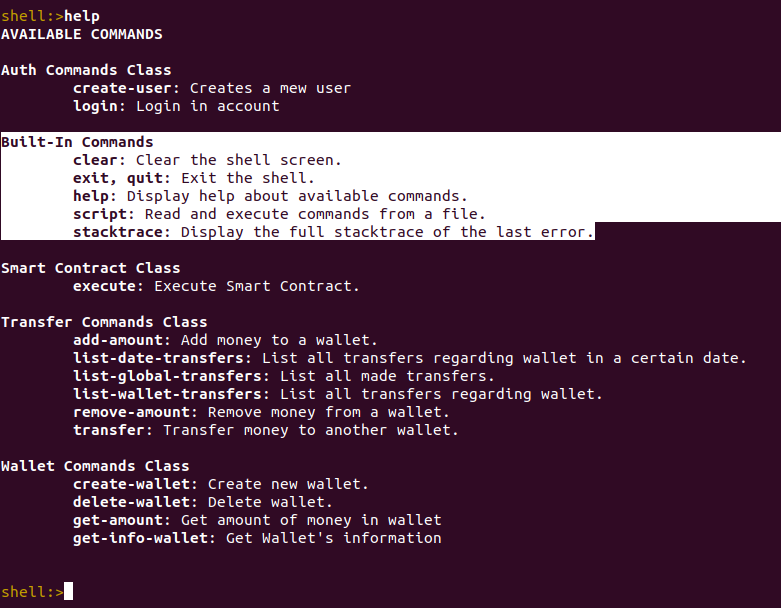

[< Para trás](../README.md)
# Confiabilidade de Sistemas Distribuidos (Client)

**Tecnologias utilizadas**

* Spring Shell - [Referência](https://projects.spring.io/spring-shell/)
* Spring Boot 2.2.5
* Maven
* Java 8

Initializer [aqui](https://start.spring.io/).

---

## Quick start

```cmd
cd Client
mvn spring-boot:run
```

---

## Funcionalidades



---

## Configurações TLS
### Setup
* Exportar certificado do servidor da sua keystore
```bash
keytool -export -alias walletcert -file serverCert.crt -keystore ../Server/TLS/walletCert.jks -storepass wallet
```
* Importar certificado do servidor para a truststore
```bash
keytool -import -trustcacerts -alias clientcert -file serverCert.crt -keystore client.jks
```

---

## Informação adicional

### Comandos Git
```bash
git clone https://github.com/rfa-lopes/CSD.git
git pull origin master
git add .
git commit -m "Initial commit"
git push
```


### Autores
* Rodrigo Lopes - rfa.lopes@campus.fct.unl.pt
* João Santos - jmfd.santos@campus.fct.unl.pt
* João Ramalho - jl.ramalho@campus.fct.unl.pt

---

[< Para trás](../README.md)
