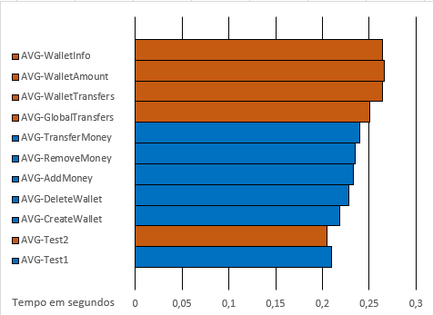

[< Para trás](../../../README.md)

# WA3 - Auditoria ao sistema.
"This challenge is an auditing of the system about the security guarantees enabled/supported after the WA#2 Implementation"

---
## Configurações TLS entre Cliente e Servidor
Atualmente a conexão entre o Cliente da aplicação e o Servidor está suportada sob TLS na vertente Server-Side Authentication, com a autenticação do servidor a ser conseguida através de um certificado self-signed. A comunicação está apenas a aceitar TLSv1.2 e TLSv1.3. Estas configurações podem ser vistas [aqui](../../src/main/resources/application.properties).

---
## Configurações TLS do BFT-SMaRt
"Search/analyze that these channels are protected by confidentiality, integrity, non-replaying and authentication (Peer-Authentication versus Message Authentication)"

### "Is this communication secure (with the security guarantees provided and enabled by BFT SMaRt)?"
Analisando, o ficheiro [system.config](../../config/system.config) presente na diretoria config do repositório do BFT SMaRT, é possível concluir que por default o SSL/TLS se encontra ativo, com a versão do TLSv1.2 a ser utilizada, mas podendo ser modificada para versões alternativas. O mesmo acontece com os ciphersuits utilizados, que por defeito está definido com "TLS_ECDHE_ECDSA_WITH_AES_128_GCM_SHA256", podendo ser utilizado numa variante sem AES ou com uso de algortimos RSA.
Atendendo às pre-sets utilizadas nas configurações referentes ao suporte de SSL/TLS, bem como às alternativas possíveis, classificamos esta vertente da comunicação como segura.

---
## Tempos de resposta do servidor ao cliente

🔶 Unordered operation

🔷 Ordered operation

**NOTA:** Ficheiro do output dos testes automáticos [aqui](Test_4GOOD_Servers_NOFAILS.txt).

---
## Tests SSL
O output do script de auditoria ao TLS do servidor pode ser visto [aqui](testsssl.txt).

---
[< Para trás](../../../README.md)
