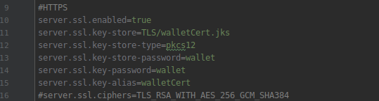

[< Para trás](../../../README.md)

# WA3 - Auditoria ao sistema.
"This challenge is an auditing of the system about the security guarantees enabled/supported after the WA#2 Implementation"

---
## Configurações TLS entre Cliente e Servidor
Atualmente a conexão entre o Cliente da aplicação e o Servidor está suportada sob TLS na vertente Server-Side Authentication, com a autenticação do servidor a ser conseguida através de um certificado self-signed. A comunicação está securitizada sem o uso de restrições quanto aos algoritmos criptográficos utilizados.

---
## Configurações TLS do BFT-SMaRt
"Search/analyze that these channels are protected by confidentiality, integrity, non-replaying and authentication (Peer-Authentication versus Message Authentication)"

system.communication.secretKeyAlgorithm = PBKDF2WithHmacSHA1
system.communication.secretKeyAlgorithmProvider = SunJCE
system.communication.hashAlgorithm = SHA-256
system.communication.hashAlgorithmProvider = SUN

#Force all processes to use the same public/private keys pair and secret key. This is useful when deploying experiments
#and benchmarks, but must not be used in production systems. This parameter will only work with the default key loader.
system.communication.defaultkeys = true

#Set to 1 if SMaRt should use signatures, otherwise set to 0 (default is 0).
#To perform replica benchmarking verification without signature creation at clients, set to 2.
system.communication.useSignatures = 0

system.ssltls.protocol_version = TLSv1.2

##ECDSA
system.ssltls.key_store_file=EC_KeyPair_256.pkcs12
system.ssltls.enabled_ciphers = TLS_ECDHE_ECDSA_WITH_AES_128_GCM_SHA256,

### "Is this communication secure (with the security guarantees provided and enabled by BFT SMaRt)?"
Analisando, o ficheiro system.config presente na diretoria config do repositório do BFT SMaRT, é possível concluir que por default o SSL/TLS se encontra ativo, com a versão do TLSv1.2 a ser utilizada, mas podendo ser modificada para versões alternativas. O mesmo acontece com os ciphersuits utilizados, que por defeito está definido com "TLS_ECDHE_ECDSA_WITH_AES_128_GCM_SHA256", podendo ser utilizado numa variante sem AES ou com uso de algortimos RSA.
Atendendo às pre-sets utilizadas nas configurações referentes ao suporte de SSL/TLS, bem como às alternativas possíveis, classificamos esta vertente da comunicação como segura.

---
## Tempos de resposta do servidor ao cliente
//TODO: Ficheiro de tests automáticos (gráfico?)

**NOTA:** Ficheiro do output [aqui](Test_4GOOD_Servers_NOFAILS.txt)

---
## Conclusões
//TODO

---
[< Para trás](../../../README.md)
