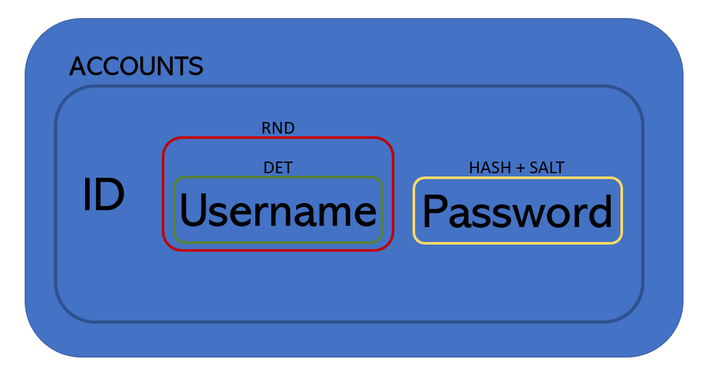
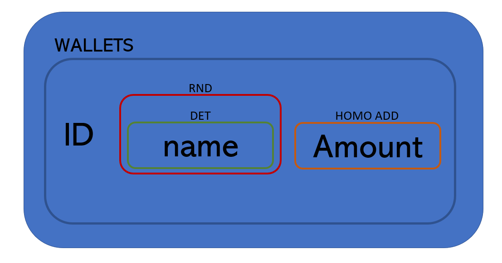
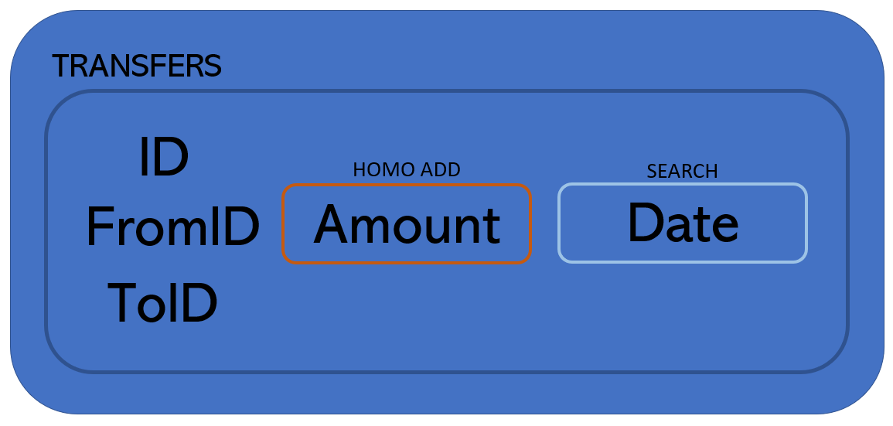
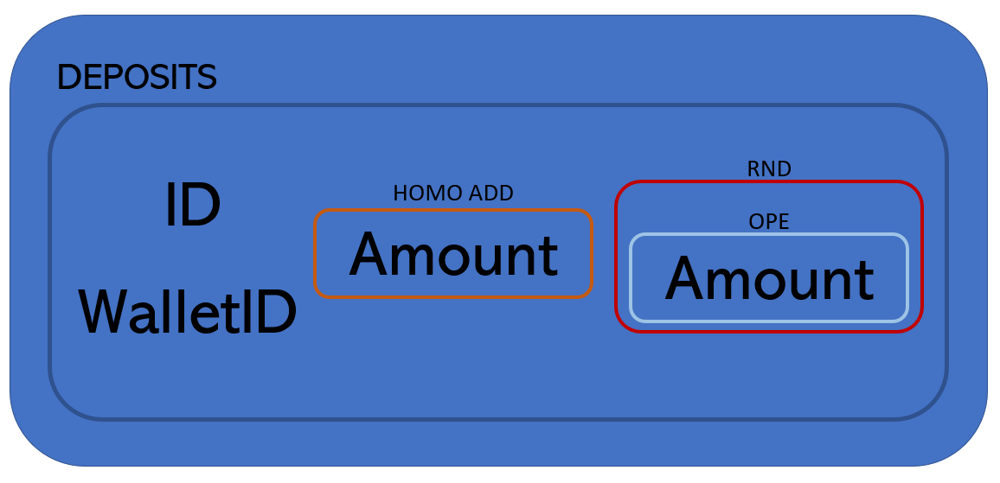

# Documentação do projeto final.

## Trabalho realizado (WA1, WA2, WA3, WA4)
* TLS - Autenticação do lado do servidor: [aqui](../../../Server#configurações-tls-wa1)
* Tolerância a falhas Bizantinas: [aqui](../../../Server#garantias-para-tolerância-a-servidores-bizantinos)
* Assinaturas das replicas: [aqui](../../../Server#receção-das-respostas-assinadas-das-réplicas-postman)
* Smart Contracts: [aqui](../../../Server#smart-contracts)

## Trabalho realizado (Projeto final)

### Autenticação: [aqui](../../../Server/Documentation/AUTHENTICATION.md)

Para a autenticação dos clientes foi criado um mecânismo de username:password, tendo sido necessário a implementação do conceito de Account no nosso sistema, tendo este acesso à criação de multiplas Wallets. 

O sistema de autenticação utiliza um mecânismo de tokens sendo este um JSON Web Token criado pelo servidor após o login do cliente. Este token tem um tempo de expiração de 10min, não havendo para já um mecanismo de refresh do token, tendo o cliente que, apo´s estes 10min, ter que refazer o login. A password é guardada na base de dados em formato de hash + salt de modo a mitigar a comparação de hashes iguais no sistema.

### Homomorphic encryption: 

A parte mais importante do projeto foi a utilização de cifras homomórficas que fornecem operações sobre dados cifrados. 

Começamos por estudar a nossa base de dados e entender os dados mais relevantes a serem cifrados e a forma como o iamos fazer para cada dado de acordo com as operações fornecidas. Visto que a arquitectura inicial do projeto não foi desenhada a pensar nesta fase final, tivemos que nos adaptar à medida que iamos iterando o projeto ao longo do semestre. 

Para o melhor entendimento da forma como estruturamos a nossa base de dados e cifras decidimos criar uma imagem para cada tabela com a informação de cada coluna e respetivas cifras.

#### Accounts table

Para a tabela de accounts pensamos em utilizar uma Onion Equality de modo a encontrarmos o username na tabela no ato de login. A password poderia ser ainda cifrada com mais uma camada RND para mitigar possiveis cracks à hash, mas achamos por bem não o fazer também para sobre carregar o sistema com tantas operações.

---

#### Wallets table

Na tabela de wallets usamos a mesma estratégia do username do utilizador para a cifra do nome da wallet, sendo que para o atributo amount, dado que faziamos operações de soma e subtração neste campo, houve a necessidade de uma cifra de HOMOADD para a continuidade das mesma operações sobre este campo.

---

#### Transfers table

---

#### Deposits table

---

#### Account - Wallets association table

---

---
---

## Trabalhos futuros
* TODO:
