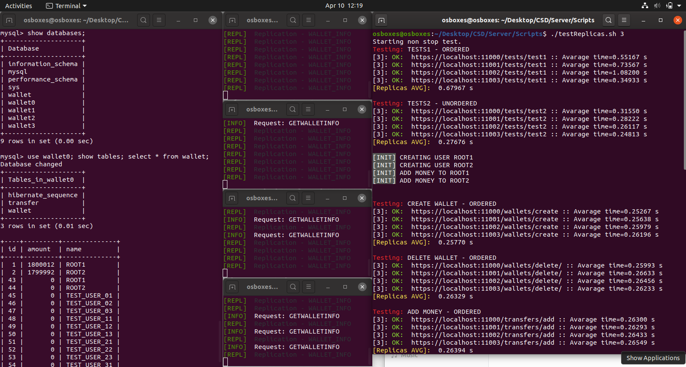

[< Para trás](../README.md)
# Confiabilidade de Sistemas Distribuidos (Server)

**Tecnologias utilizadas**

* **Spring Boot 2.2.5** (WA1, WA2 e WA3)
* **Maven** (WA1, WA2 e WA3)
* **Java 8** (WA1, WA2 e WA3)
* **MySQL** (WA1, WA2 e WA3)
* **BFT-SMaRt** (WA2 e WA3)

Initializer [aqui](https://start.spring.io/).

---

## Quick test
### 0 - Dar DROP às bases de dados (caso existem) e criar novas. (WA2)
```bash
./Scripts/create4databases.sh
```

### 1 - Correr os servidores (pode demorar cerca de 60 segundos a arrancar) (WA2)

```bash
./Scripts/runFourReplicas.sh
```

**OU** em terminais diferentes

```bash
./Scripts/runOneReplica.sh 0
./Scripts/runOneReplica.sh 1
./Scripts/runOneReplica.sh 2
./Scripts/runOneReplica.sh 3
```
### 2 - Correr os testes automáticos (arg = número de requests por cada funcionalidade) (WA3)

```bash
./Scripts/testReplicas.sh 3
```

---

## Funcionalidades (WA1)
### Tests
* Documentação [Tests](Documentation/TESTS.md).
### Wallets
* Documentação [Wallets](Documentation/WALLETS.md).
### Transfers
* Documentação [Transfers](Documentation/TRANSFERS.md).

---

## Arquitecturas

### Servidor não replicado (WA1)


### Replicação (WA2)
BFT-SMaRt [aqui](https://github.com/bft-smart/library/wiki/Getting-Started-with-BFT-SMaRt).


**NOTA IMPORTANTE:**
 Nos nossos testes ao sistema utilizamos uma base de dados comum a todas as replicas e verificaram-se várias escritas na base de dados na operação de criar uma nova wallet, o que demonstra que o sistema funciona.
 Porém em termos funcionamento, as operações create wallet e delete wallet não se encontram a funcionar corretamente enquanto não for implementada uma solução (Docker) onde cada replica tem a sua base de dados.

---

## Configurações TLS (WA1)

### Setup
* Criar par de chaves e metê-las na keystore
```bash
keytool -genkey -keyalg RSA -alias walletCert -keystore walletCert.jks -storepass wallet -validity 365 -keysize 4096 -storetype pkcs12
```

### Propriedades
* Algorithm: RSA
* init validity: 365 days
* Key size: 4096
* Store type: PKCS12

### Nomes e Segredos
* Alias key: walletCert
* Key store name: walletCert.jks
* Store password: wallet

---

## Utils (WA1, WA2 e WA3)
### Comandos MySQL
```SQL
create database wallet;
show databases;
use wallet;
show tables;

SELECT * FROM wallet;
SELECT * FROM transfer;
INSERT INTO wallet VALUES (0, 'John', 9041)
```
### Iniciar/Parar base de dados MySQL.
```bash
sudo systemctl start mysql
sudo systemctl stop mysql
```
---
## Testes (WA1, WA2 e WA3)

### Manuais com Postman


### Automáticos


**NOTAS:** Mais testes feitos [aqui](Documentation/Images/).

---

## Informação adicional

### Comandos Git
```bash
git clone https://github.com/rfa-lopes/CSD.git
git pull origin master
git add .
git commit -m "Initial commit"
git push
```

### Autores
* Rodrigo Lopes - rfa.lopes@campus.fct.unl.pt
* João Santos - jmfd.santos@campus.fct.unl.pt
* João Ramalho - jl.ramalho@campus.fct.unl.pt

---

[< Para trás](../README.md)
